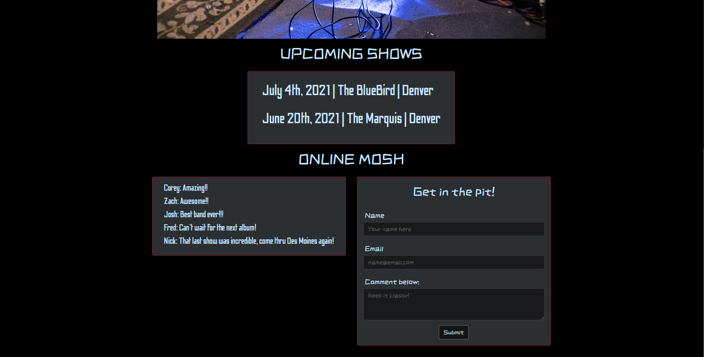

# Trilogybyte

## Description

This full-stack application allows users to view Trilogybyte's upcoming shows and other user's comments. Additionally, users can publish their own comments for others to view.

## Table of Contents

- [Usage Information](#Usage-Information)
- [Links](#links)
- [Contributors](#contributors)
- [Technologies Used](#technologies-used)

## Usage Information

Fill out the input form and click submit to post your comment publicly and store your email.

## Links

[Deployed Application](https://salty-reaches-86941.herokuapp.com/)

## Contributors

- [Corey's GitHub](https://github.com/Cblock7)
- [Zach's GitHub](https://github.com/zachraab)
- [Joshua's GitHub](https://github.com/mentaltemple)

## Technologies Used

- Node [Link](https://nodejs.org/en/docs/)
- Express [Link](http://expressjs.com/)
- Express Handlebars [Link](https://www.npmjs.com/package/express-handlebars/v/3.0.0)
- MySQL [Link](https://dev.mysql.com/doc/)
- Sequelize [Link](https://sequelize.org/master/)
- TypeIt [Link](https://typeitjs.com/)
- Dotenv [Link](https://www.npmjs.com/package/dotenv)
- HTML [Link](https://developer.mozilla.org/en-US/docs/Web/HTML)
- CSS [Link](https://developer.mozilla.org/en-US/docs/Web/CSS)
